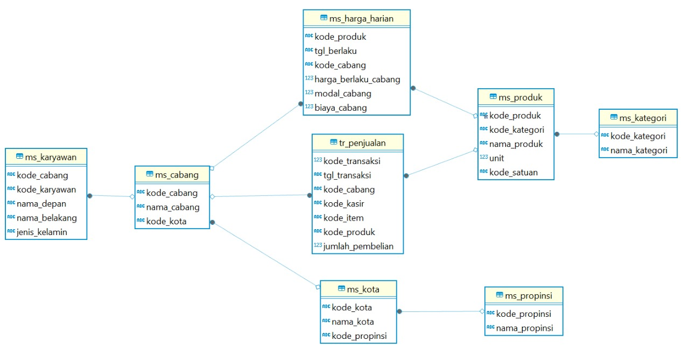

# Retail Sales & Profitability Analysis with SQL Database Design

  

### Resources
- 📊 [Full Analysis (Medium)](https://medium.com/@bintangpradanaa/studi-kasus-perancangan-database-minimart-dan-analisis-data-menggunakan-sql-110cd3be15d4)  
- 💻 [SQL Code](https://github.com/bintangpradanaa/retail-sales-profitability-analysis-with-sql-database-design/blob/main/SQL%20Code/minimart.sql)

## Project Overview
Minimart is a growing retail company operating across multiple branches in Indonesia, offering products such as food, beverages, vegetables, and fruits. However, only a portion of branches currently have recorded sales data.

As a **Data Analyst**, I was tasked with designing a structured database and analyzing transactional data to generate business insights that support decision-making and improve operational efficiency.

This project follows a structured data analysis approach: data preparation, database design, querying, and insight generation.

## Problem Statement
- Identify branches with and without sales transactions  
- Evaluate sales and profit performance across branches and time  
- Analyze product performance and profitability  
- Understand transaction trends and employee contributions  

## Data & Database Design
The database consists of **8 relational tables**:
- `ms_cabang`, `ms_karyawan`, `ms_produk`, `ms_kategori`
- `ms_harga_harian`, `tr_penjualan`
- `ms_kota`, `ms_propinsi`

Designed using **relational modeling (ERD)** with proper key relationships.

  

## Tools
- MySQL  
- DBeaver  

## Key Insights

- Only 3 branches have transaction data, indicating incomplete data integration and limited visibility for decision-making.
- Profit increases from Q1 to Q3 but drops in Q4, suggesting missed opportunities during peak end-of-year demand.
- Transactions fluctuate, with several months consistently below average, indicating unstable sales performance.
- One branch significantly outperforms others, showing imbalance in operational or market effectiveness.
- Some products (e.g., kobis) have high sales volume but low profitability, indicating inefficiencies in pricing or cost structure.
- Top-performing employees contribute disproportionately to transactions, highlighting performance gaps across staff.

## Recommendations
- Centralize data from all branches to enable complete and reliable business analysis.
- Launch targeted year-end campaigns (bundling, seasonal promos, incentives) to capture high demand periods.
- Focus promotions on consistently low-performing months to reduce volatility.
- Replicate successful strategies from top-performing branches to underperforming ones.
- Reevaluate pricing and cost structure for high-volume but low-margin products (e.g., kobis).
- Implement incentive systems and training programs to elevate overall employee performance.

## Output
- Relational database (8 tables)  
- SQL-based analysis  
- Actionable business insights
